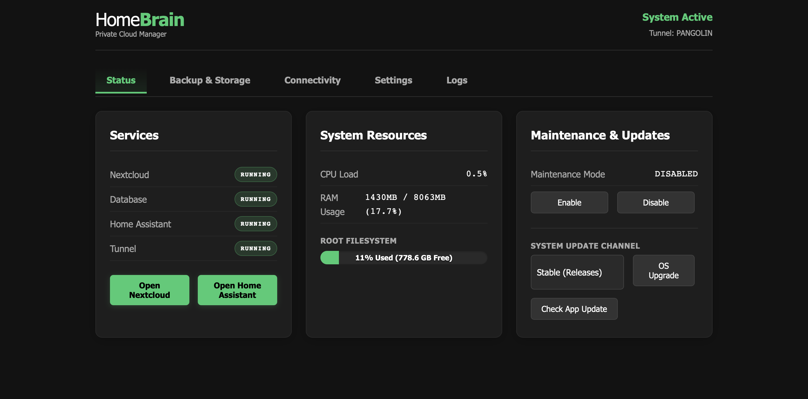

# HomeBrain: Automated Raspberry Pi Cloud Server Deployment

Deploy and manage your own fully private, internet-accessible Raspberry Pi server with Nextcloud and Home Assistant in under 10 minutes—no static IP, port-forwarding, or dynamic DNS required.

HomeBrain automates setup using Docker containers and supports secure tunnels via Pangolin. It includes a Flask-based Web UI for easy management of system health, backups, restores, and configurations like watchdog timers and FTP.

## Key Features
- **Plug-and-Play Deployment**: Headless installation on Raspberry Pi 5 with pre-configured tunnels.
- **Services Management**: Run Nextcloud, Home Assistant, databases, and tunnels with one-click access.
- **System Monitoring**: Real-time overview of CPU, RAM, storage, and service status.
- **Backups & Restores**: Automated scheduling, drive selection, formatting, and retention policies.
- **Maintenance Tools**: Update channels, app checks, and optional features like FTP or watchdog.
- **Secure Access**: Tunnel-based external connectivity without exposing your network.

## Connectivity Overview
HomeBrain uses Pangolin tunnels to provide secure external access to services via a single registered domain:
- The main domain (e.g., `cloud.example.com`) routes to the HomeBrain Manager Web UI for administration.
- Nextcloud is accessible via the `nc` subdomain (e.g., `nc.cloud.example.com`).
- Home Assistant is accessible via the `ha` subdomain (e.g., `ha.cloud.example.com`).

All routing is automatically configured through the provisioned tunnel during setup, ensuring seamless and private connectivity.

## Prerequisites
- Raspberry Pi 5 with LAN internet access (headless setup).
- Fresh 64-bit Raspberry Pi OS Lite installation with SSH enabled.
- Registered domain via Pangolin.
- Tunnel created in your Pangolin dashboard (with access keys).

## Installation

### 1. Bootstrap
Download and install core dependencies:

```bash
curl -fsSL https://raw.githubusercontent.com/oalterg/homebrain/main/install | sudo bash
```

### 2. Provision Tunnel
Run the provisioning script with your tunnel credentials (replace placeholders):

```bash
# Usage: provision.sh <NEWT_ID> <NEWT_SECRET> <MAIN_DOMAIN> <PAN_EP> <FACTORY_PASS>
sudo /opt/homebrain/scripts/provision.sh "id" "secret" "cloud.example.com" "https://myPangolin.endpoint" "pwd"
```

## Usage
Access the Web UI at the root Pangolin registered domain, or locally at `http://<RPI_IP>/`, to manage services, monitor resources, configure backups, and handle updates. The dashboard provides a centralized view for all operations.

## HomeBrain Manager Dashboard Screenshot


## License
BSD-3-Clause. See [LICENSE](LICENSE) for details.